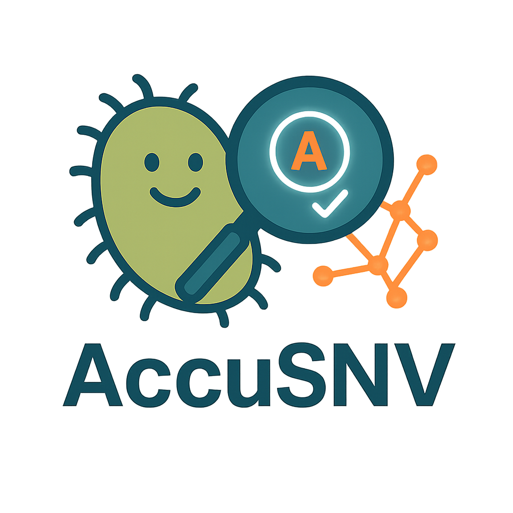
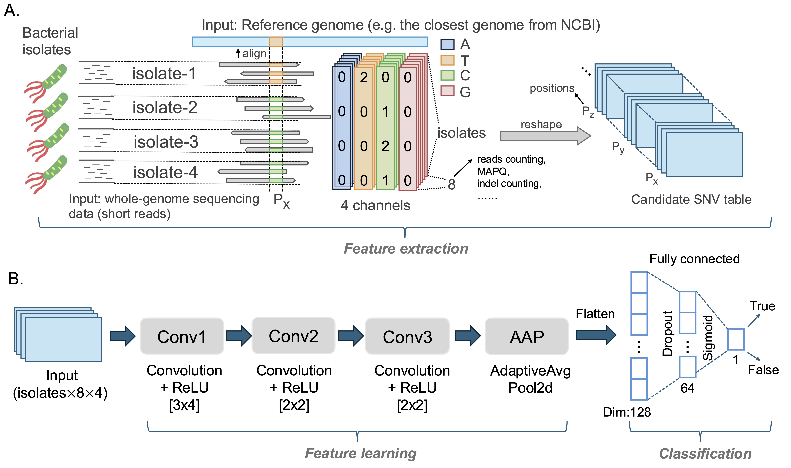

[](https://anaconda.org/bioconda/accusnv)

#   High-accuracy SNV calling for bacterial isolates using AccuSNV 

### Version: V1.1.0 (Last update on 2026-August)

AccuSNV is a computational pipeline designed to identify single nucleotide variants (SNVs) in short-read whole genome sequencing data between genomes in a group of bacterial isolates. 

Candidate SNVs are identified by a Convolutional Neural Network of pileup features to improve the accuracy of variant detection.

AccuSNV takes WGS data and a reference genome as input, and outputs SNV tables, phylogenetic trees, dN/dS analyses, and an interactive HTML for exploring SNVs.

The architecture of the AccuSNV convolutional neural network:

#   


## Overview

This pipeline is used to identify and analyze single nucleotide differences between bacterial isolates from short read WGS data. 

* Inputs
	* Short-read sequencing FASTQ data from multiple (>=3) bacterial isolates.
  * A sample sheet describing the reference genome, grouping, and outgroup to use for each sample.
	* Reference genome FASTA file(s), with optional annotations (gff). 
  * More details can be found under [Usage](#full-usage).
  
* Outputs 
	* Table of high-quality SNVs differentiating the isolates in the dataset.
  * Mutation types and their associated gene annotations.
  * dN/dS and dMRCA calculations.
  * Parsimony tree of isolates.
  * More details can be found under [Output](#output).


Note: This tool is based on the Lieberman and Key Lab SNV calling pipeline - [WideVariant](https://github.com/liebermanlab/WideVariant). We are maintaining an updated version of that pipeline in this repository for preprocessing data for input to the AccuSNV CNN.


## Contents

- [Install](#install)
- [Quick Test](#quick-test-local)
- [Usage](#full-usage)
- [Output](#output)
- [Full command-line options](#full-command-line-options)
- [Contact](#contact)
- [Cite](#citation)


-------------------------------------------------

## Install

**Install dependencies** with conda or mamba, or otherwise have them installed system-wide:

```
conda create -n accusnv python=3.13
conda activate accusnv
conda install -c bioconda bwa bowtie2 samtools bcftools tabix sickle-trim cutadapt samclip phylip
```

(the phylip package installs dnapars, which must be on path for AccuSNV tree building)

Then install **AccuSNV and Python dependencies** (requires Python>=3.9):

```
git clone https://github.com/acritschristoph/AccuSNV.git
cd AccuSNV
pip install .
```

The default aligner for AccuSNV is `BWA-MEM` (with `samclip`), but you can also use `bowtie2` by changing the aligner value in the config file.

If those binaries are in a different environment from the one you run `accusnv` in, pass `-e 'conda activate <env>'`, so every workflow rule activates it first.

## Quick Test (local)

Run in a local compute environment (e.g., laptop or on a single node) by passing the `-m local` parameter. 
This command prepares the output directory, writes the config files, and runs the pipeline:

```
accusnv -m local -i Test_data/samples_cae_test_pe.csv -r Test_data/reference_genomes -o cae_accusnv_output
```

Here, `samples_cae_test_pe.csv` is an example input sample table, and `Test_data/reference_genomes` is an example directory of reference genomes for these samples. Add `-j <cores>` to set how many cores the local run uses.

## Quick Test (HPC cluster) 

Run on a **Linux HPC system (cluster)** with a [Slurm](https://slurm.schedmd.com/overview.html) scheduler by passing `-m slurm`. Typically, we recommend that you run AccuSNV on an HPC cluster, and we provide out of the box Snakemake support for Slurm clusters:

```
accusnv -m slurm -sp <partition> -i Test_data/samples_cae_test_pe.csv -r Test_data/reference_genomes -o cae_pe_test_snakemake
```

This submits the whole pipeline as Slurm jobs. `-sp` chooses the partition(s) to submit to. This can be comma-separated for more than one (e.g. `-sp short,long`), or you can omit it to let sbatch use your cluster default. 

>For a description of the resulting output files, see [Output files of AccuSNV](readme_files/readme_test_output.md), or read on below.

>*Note*: On some clusters you must activate your conda environment on the compute nodes. Pass `-e 'conda activate accusnv'` so every workflow rule activates it first.

## Changing config parameters

There are two AccuSNV config yaml files:

`pipeline.yaml`: All pipeline parameters, including the aligner, adapter sequence, and the read trimming, mapping, variant calling, CNN filter and recombination cutoffs.

`config.yaml`: Contains snakemake parameters, including partitions and slurm params. It is less likely you will have to edit this file.

Both files are created and filled with their default values the first time you run AccuSNV, in `<output_dir>/configs/`.


The defaults for this are written into `<output_dir>/configs` on the first run with defaults filled in. 

To change any of them, copy that file, edit it, and pass it back with `-p`. These files will then be copied into `<output_dir>/configs/`.

When you pass any command line arguments, such as `-sp` (`--partition`), `-j` (`--cores`), `--skip_recombination`, the config files created or copied to `<output_dir>/configs/` will have these values automatically updated.


## Full Usage

First, you must ensure that all of your input files follow the same format as the example files used in the **Quick Test** above.

### 1. Prepare necessary input files

AccuSNV requires three types of inputs: 

- **A sample sheet CSV** 
  - Same format as the **Quick Test** CSV files. Examples can be found in the folder [Test_data](Test_data/) (e.g. `Test_data/samples_cae_test_pe.csv`).
  - In this sample sheet, individual samples can be assigned to sample *groups*. Samples within the same Group are analyzed together and separately from other samples.
  - Detailed description for this file can be found [here](readme_files/readme_input_csv.md).

- **A directory of FASTQ files.** 
  - AccuSNV does not take FASTQ paths directly. For each sample it locates the reads by combining the Path (the folder to search) and the FileName (the read-file prefix) columns from your sample sheet, and then searching the Path folder for files that match.
  - Accepts gzipped or plain FASTQ files with extensions: .fastq.gz, .fq.gz, .fastq, or .fq.
  - For paired end reads, R1/R2 files must be distinguished by a `1`/`2` joined by `_`, `.`, or `-`. 

- **A reference genome directory** 
  - Each reference should be in its own subfolder within the reference genome directory, and have one FASTA file ending in `.fasta`, `.fa`, or `.fna`.
  - Annotations such as `genome.gff` (from NCBI, or generated by [Prokka](https://github.com/tseemann/prokka) or [Bakta](https://github.com/oschwengers/bakta)) are recommended for mutation annotation and gene-based analyses. Only put one `gff` file in each reference genome subfolder - this `gff` will be assumed to be the annotations for that particular reference genome. 
  - Avoid reference folder names that start with `ref_` or contain `_ref_` because AccuSNV uses `_ref_` as an internal filename delimiter. 
  - AccuSNV can generate BWA/samtools indexes during the Snakemake run (`genome.fasta.bwt`, `.amb`, `.ann`, `.pac`, `.sa`, and `.fai`); if the reference directory is not writable, pre-create them with `bwa index genome.fasta` and `samtools faidx genome.fasta`. 
  - Examples can be found in the folder [Test_data/reference_genomes](Test_data/reference_genomes/).


A detailed description of the input directory structure and files can be found here: [Input files of AccuSNV](readme_files/readme_input_csv.md).

### 2.  Run the Snakemake pipeline

For running on an HPC with Slurm:

```
accusnv -m slurm -sp <partition> -i <samples.csv> -r <reference_genomes_dir> -o <output_dir>
```

You can first test the workflow with a Snakemake dry run, which creates the default output folder and config files, and builds and prints the job graph without running anything:

```
accusnv -m dryrun -i <samples.csv> -r <reference_genomes_dir> -o <output_dir>
```

If you do not use Slurm (single node/local run), instead run:

```
accusnv -m local -j <cores> -i <samples.csv> -r <reference_genomes_dir> -o <output_dir>
```

### 3. Re-run downstream evolutionary analyses separately

By default, the full AccuSNV snakemake pipeline will calculate distance to Most Recent Common Ancestor (dMRCA), dN/dS, and identify parallel mutations. 

However, users may often wish to re-run these analyses without re-running the entire SNV calling pipeline. To do so, pass `--downstream_only` with the same inputs and output directory as the original run:

```
accusnv --downstream_only -i <samples.csv> -r <reference_genomes_dir> -o <output_dir>
```

This reads the calling-stage output already in `<output_dir>/2-SNV-filtering/group_<group_id>/` and re-runs annotation, dN/dS, tree building and the dashboard, without repeating read mapping or SNV calling. The cutoffs these stages use are in `pipeline.yaml`, so consider inspecting and editing that file before running.

In the future, we plan to facilitate more interactive versions of these evolutionary analyses that allow the user to visualize, inspect, and interact with their data. 

## Output

The results for each sample group are written at the top level of the output directory, one set per group (e.g., for **Quick Test**, `cae_pe_test_snakemake/group_pe_test_snv_table_final.tsv`). Raw data tables and diagnostic information are in: `2-SNV-filtering/group_[group_name]/` and `3-Analysis/group_[group_name]/`.

### Core output files:

| File or Folder |  Description |
| ---  | --- | 
| `group_<group>_snv_table_final.tsv`  | Final SNV report table (recommended primary output table). More details, including explanations of the columns in this file, can be found [here](readme_files/readme_annotation_table.md).
| `group_<group>_snv_dashboard.html`  | Interactive final HTML report (recommended to view).
| 2-SNV-filtering/group_<group>/snv_table_unfiltered.tsv` | Every position AccuSNV called with the CNN and rule-based filter breakdown for each.
| `2-SNV-filtering/group_<group>/snv_table_cnn_raw.tsv` | Per-position CNN scores for every position scored. Note that this file does not include annotation information for each SNV.

For final SNV calling results, please use:

`group_<group>_snv_table_final.tsv` as the primary human-readable SNV result table.

For full documentation of all output files, please see [here](readme_files/readme_test_output.md).

### Downstream evolutionary analysis output files:
| File or Folder |  Description |
| ---  | --- | 
| `./3-Analysis/group_<group>/dNdS_out/data_dNdS.npz`  | dN/dS values. Contains dNdS, a confidence interval, and the N/S mutation counts. The same numbers are written as text in `dnds_genomewide.tsv`, with a per-gene breakdown in `dnds_per_gene.tsv`.
| `group_<group>_snv_tree_final.nwk.tree` | Newick parsimony tree built by **dnapars**.
| `./3-Analysis/group_<group>/phylogeny/snv_table_tree_distances.tsv`  | Per-sample SNP distances to ancestor.
| `./3-Analysis/group_<group>/snv_trees/*`  | per-SNV files named p_<position>_<N>.tree. Written only when you pass `--build_snv_trees`.
| `./3-Analysis/group_<group>/per_snv_barcharts/`  | Per-SNV bar chart images, linked from the dashboard.


## Full command-line options

```
usage: accusnv [-h] [-i CSV] [-r DIR] [-o DIR] [-c FILE] [-p FILE]
        [-m {dryrun,slurm,local}] [-j N] [-sp PARTITIONS] [-e CMD] [output options]

AccuSNV
High-accuracy SNV calling for bacterial isolates using deep learning.

Inputs and Outputs:
  -i, --input_sample_info CSV      Input sample CSV (required)
  -r, --ref_dir DIR                Reference genomes dir (required)
  -o, --output_dir DIR             Output dir (default: accusnv_output)

Config:
  -c, --config_file FILE           Execution settings + run paths
                                   (config.yaml; default: autogenerated in
                                   out_dir)
  -p, --pipeline_file FILE         Pipeline params (pipeline.yaml; default:
                                   autogenerated in out_dir)
  -m, --mode {dryrun,slurm,local}  Run mode (default: local)
  -j, --cores N                    Cores for local execution (default: value
                                   in config.yaml, 4)
  -sp, --partition PARTITIONS      SLURM partition(s) to submit to, comma-
                                   separated list for >1 (default: not
                                   specified)
  -e, --env CMD                    Environment activation command, e.g. 'conda
                                   activate accusnv' (default: inherit current
                                   environment)

Output options:
  --skip_all_downstream            Skip all downstream evolutionary analyses
                                   and report generation
  --skip_report                    Skip generating the HTML report
  --skip_recombination             Skip recombination detection. On by
                                   default: recombinant SNVs are flagged and
                                   kept in the SNV tables, but left out of
                                   dN/dS, tree building and dMRCA. Pass this
                                   to stop flagging them, which counts them
                                   everywhere
  --skip_dnds                      Skip dN/dS calculations
  --skip_trees                     Skip parsimony tree building (dnapars)
  --build_snv_trees                Write one NEXUS tree per SNV, tips coloured
                                   by basecall, for viewing in FigTree
                                   (default: off)
  --downstream_only                Run only downstream analyses (Assumes
                                   AccuSNV SNV tables and output directory
                                   already exist)
```

Every other parameter is in the two YAML files, which are written into `<output_dir>/configs` with defaults on each run:

* `pipeline.yaml` has the pipeline parameters the workflow reads: aligner, threads, adapter, and the read trimming, mapping, variant calling, CNN filter and recombination cutoffs. The per-sample and per-position filter cutoffs that older versions took as `-a`, `-p`, `-t`, `-s`, `-v` and `-e` flags are set here.
* `config.yaml` has the Snakemake execution settings (executor, cores, jobs, partition, resources) plus the run paths, filled in automatically from `-i`, `-r` and `-o`.

To customize either one, edit the generated default file, and pass it back with `-p` or `-c`.

## Contact
  
 If you have any questions, please post an issue on GitHub or email us: 
 
 Herui Liao (creator) herui728@mit.edu

 Alex Crits-Christoph (maintainer) crits@mit.edu

## Citation

How to cite this software:

>Liao, Herui, Arolyn Conwill, Ian Light-Maka, Martin Fenk, Alyssa H. Mitchell, Evan B. Qu, Paul Torrillo, Jacob S. Baker, Felix M. Key, and Tami D. Lieberman. "[High-accuracy SNV calling for bacterial isolates using deep learning with AccuSNV](https://genome.cshlp.org/content/early/2026/07/02/gr281341125)." *Genome Research*. June 2026, Vol. 36, No. 6. [https://doi.org/10.1101/gr.281341.125](https://doi.org/10.1101/gr.281341.125)


